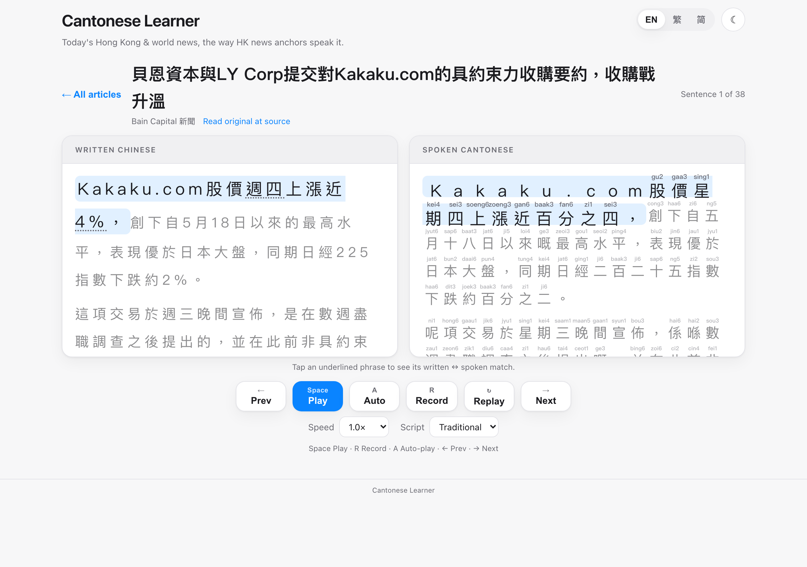

# Cantonese Learner V2

**Learn to *speak* Cantonese from today's real Hong Kong news — and from the
conversations you'll actually have living there.**

Every day the app pulls a fresh batch of genuine RTHK news stories, rewrites
each one the way a **Hong Kong TV anchor would say it aloud**, prints
**jyutping** (romanised pronunciation) above every character, reads it to you,
and grades you — character by character — when you read it back. New in V2: a
curated **everyday-conversations curriculum** (cha chaan teng, taxis, the
office, portfolio reviews…), **auto-play** for hands-free listening, numbers
you can finally pronounce, and a **tap-to-compare** view that shows exactly
which written phrase became which spoken phrase.

**▶️ Try it: https://lyhjeremy.github.io/cantonese-learner-v2/**
*(V1 remains live at https://lyhjeremy.github.io/cantonese-learner/)*

No sign-up, no install, no keys. Use **Chrome** for the speaking/scoring
feature — other browsers can listen and read.



---

## What's new in V2

1. **Much better Cantonese.** When the daily build runs with an Anthropic API
   key, every sentence is rewritten by **Claude (Opus 4.8)** into genuinely
   natural anchor-Cantonese, then **cross-checked by a second, independent
   Claude reviewer pass** that hunts for exactly the class of error the old
   rule converter made (不足 mechanically becoming 唔足, 其他 becoming 其佢…)
   and repairs anything it flags. Lessons built this way carry a green
   "cross-checked" banner. The keyless rule-based fallback was also hardened
   with a ~10× larger protect-list so those compounds can't be mangled there
   either.
2. **Numbers you can pronounce.** Arabic numerals used to have no jyutping and
   no reliable reading. V2 spells every number out on the spoken side, the way
   an anchor reads it **in context**: `2020年` → 二零二零年 (year, digit by
   digit) but `2020個` → 二千零二十個 (quantity, as a cardinal); `15%` →
   百分之十五; `54.1` → 五十四點一; `2846 3222` → digit by digit. Every
   character gets jyutping, the voice reads it correctly, and saying the
   number correctly scores green.
3. **Everyday Hong Kong conversations.** A hand-curated, natively-reviewed set
   of 10 scenario dialogues — greetings, cha chaan teng breakfast, dim sum,
   taxis, the MTR, the wet market, office small talk, scheduling meetings,
   portfolio/finance discussion, after-work drinks — with speaker labels,
   English glosses, and the same listen → speak → grade loop as the news.
4. **Tap to compare written ↔ spoken.** The rewrite now emits *aligned phrase
   pairs*: tap any underlined phrase in either pane and its counterpart lights
   up in the other, so you can see precisely that 認為 became 覺得. On phones,
   the two stacked panes are replaced by an **interleaved view** — each written
   line sits directly above its spoken version, so nothing to scroll between.
5. **Auto-play.** Press `A` (or the Auto button) and the whole article plays
   through hands-free, sentence by sentence — a podcast mode for shadowing or
   passive listening. Any manual action stops it.
6. **A second news source (optional).** The build can mix in articles from a
   WeChat 公眾號 via an RSS bridge — designed for Bain Portfolio News, so the
   lessons cover the companies you actually work with (see below).

## How you use it

1. Open the link. You'll see today's ~12 news articles plus the conversation
   scenarios below them.
2. Tap one. The reader shows the news the way it's **written** on the left and
   the way an anchor **says** it on the right, jyutping over every character.
   On a phone you get the interleaved view instead.
3. For each sentence: **Play** (`Space`) to hear it, **Auto** (`A`) to let it
   run, **Record** (`R`) to say it back — each character lights up green /
   amber / red with an overall score. `→` to move on.
4. Tap an underlined phrase to see its written↔spoken match. Adjust speed,
   Traditional/Simplified, and interface language (English / 繁體 / 简体) to
   taste.

---

## How it works

```
GitHub Actions (daily cron, 06:00 HKT)                Browser (GitHub Pages, static)
┌──────────────────────────────────────────┐          ┌──────────────────────────────┐
│ 1. fetch RTHK RSS (5 topics)             │          │ loads today.json +           │
│    + optional WeChat-bridge feed         │          │       conversations.json     │
│ 2. fetch full article bodies             │  writes  │ • side-by-side / interleaved │
│ 3. REWRITE: Claude Opus 4.8 → anchor     │  today   │   reader + jyutping ruby     │
│    Cantonese + aligned phrase pairs      │  .json   │ • tap-to-compare segments    │
│ 4. VERIFY: independent Claude reviewer   │ ───────► │ • speechSynthesis TTS (zh-HK)│
│    cross-checks & repairs every sentence │          │ • auto-play                  │
│    (keyless fallback: hardened rules)    │          │ • SpeechRecognition grading  │
│ 5. spell out numerals in context         │          │   (digits ≡ spelled-out)     │
│ 6. add jyutping (to-jyutping, local)     │          │ • trad⇄simp, tri-lingual UI  │
└──────────────────────────────────────────┘          └──────────────────────────────┘
```

- **No backend server.** GitHub Actions is the cron + build server; the site is
  static files. Nothing to deploy, pay for, or keep alive.
- **Everything fails soft.** No API key → hardened rule-based conversion. News
  fetch fails → bundled sample lessons. No Cantonese voice / no speech
  recognition → those features hide themselves.
- **Voices and grading run in the visitor's browser.** Your friends cost you
  nothing; nobody's audio leaves their machine.

### The two-pass rewrite (the heart of V2)

With an `ANTHROPIC_API_KEY` secret configured, the build makes **two Claude
calls per article** using structured outputs (schema-guaranteed JSON):

1. **Rewrite** — formal sentences → natural spoken anchor-Cantonese, plus the
   aligned `pairs` that power tap-to-compare. Pair alignment is re-validated in
   code (both sides must reproduce their sentences character-for-character);
   invalid pairs are dropped rather than trusted.
2. **Verify** — a second call with an independent "native reviewer" persona
   judges every rewrite for naturalness, meaning preservation, and mangled
   compounds, and returns corrected sentences where needed. The build applies
   the repairs and labels the day's data `llm+verify`.

Cost is a few tens of cents per day at ~12 articles; set a monthly cap in the
Anthropic console. Remove the secret and it's fully keyless again.

### Numbers, precisely

`frontend/numbers.js` is a dependency-free reading engine shared by the build
and the browser: years (3+ digits before 年, including ranges like 2020至21年)
read digit-by-digit; quantities read as cardinals with 萬/億 grouping and
correct 零 insertion; percentages, decimals, comma-grouped numbers, and long
unit-less digit runs (phone numbers) each get their own treatment. The grader
runs the *recogniser's* output through the same engine, so whether Chrome hears
"二零二零年" or "2020年", a correct reading scores green.

### The conversations curriculum

`content/conversations-src.json` is the hand-authored source (written Chinese +
spoken Cantonese + English, speaker by speaker). It was **cross-checked by
three independent AI reviewers** — one judging native naturalness of the
Cantonese, one verifying the three languages say the same thing, one checking
real-Hong-Kong accuracy (prices, Octopus, MTR, code-switching habits) — before
being baked to `frontend/data/conversations.json` with jyutping via
`npm run build:conversations`.

### The Bain news lessons (works out of the box)

The daily build reserves up to 4 lesson slots for a second, Bain-relevant
source, resolved in this order:

1. **WeChat 公眾號 bridge (preferred when configured).** WeChat has no public
   API, so 公眾號 content can only be ingested through an RSS bridge (WeRSS,
   Wechat2RSS, or similar). Set the bridge's feed URL as a repo **secret**
   named `WECHAT_FEED_URL` (plus an optional repo **variable**
   `WECHAT_SOURCE_NAME` for the card label). Note: the public Wechat2RSS
   instance only serves its own fixed account list — a custom 公眾號 needs a
   self-hosted or paid bridge, and if the content actually lives in someone's
   *Moments* (朋友圈) rather than a subscribable 公眾號, no bridge can reach it.
2. **Web-scrape fallback (default, zero setup).** With no bridge configured,
   the build scrapes the public web instead: it queries Google News (zh-HK)
   for **貝恩資本** (Bain Capital) coverage, resolves each result to the real
   publisher URL, extracts the article body, and converts it exactly like RTHK
   news — labelled "Bain Capital 新聞" on the cards. Change the topic with a
   `BAIN_NEWS_QUERY` secret/variable, or set it to `off` to disable.

Both paths fail soft: if a feed breaks or finds nothing that day, the build
carries on RTHK-only and nothing else is affected.

> ⚠️ **A note on confidentiality:** anything the build ingests is published on
> the public Pages site. Only feed it 公眾號 content that's acceptable to
> republish — or make the repo private (GitHub Pages on a private repo needs a
> paid plan) before wiring up a non-public feed.

---

## Run it locally

```bash
npm install          # deps for the builders + tests
npm run serve        # serves the app at http://localhost:5173
npm run build:news   # fetch + convert today's lessons (keyless without a key)
npm run build:conversations   # regenerate conversations.json from the source
```

To exercise the Claude rewrite locally:

```bash
ANTHROPIC_API_KEY=sk-ant-… npm run build:news
```

## Deploy

Push to `main`. `.github/workflows/pages.yml` builds the day's lessons and
publishes `frontend/` to GitHub Pages, then re-runs daily at 06:00 HKT.
`keepalive.yml` makes a tiny commit twice a month so GitHub never auto-disables
the schedule.

**Secrets/variables to configure** (repo → Settings → Secrets and variables →
Actions):

| Name | Type | Required? | Purpose |
|---|---|---|---|
| `ANTHROPIC_API_KEY` | secret | recommended | Claude rewrite + independent verifier (else: rule-based) |
| `WECHAT_FEED_URL` | secret | optional | RSS-bridge URL for the WeChat 公眾號 feed (overrides the web-scrape fallback) |
| `WECHAT_SOURCE_NAME` | variable | optional | Source label for the secondary-feed lessons |
| `BAIN_NEWS_QUERY` | variable | optional | Web-scrape fallback topic (default 貝恩資本; `off` disables) |

## Tests

```bash
npm test             # unit (chunking, rules, rewrite+verify mocked, grader,
                     #       rss + wechat fixture, numbers) + Playwright e2e
npm run test:unit
npm run test:e2e     # renders the app headless: segments, tap-to-compare,
                     #       auto-play, conversations, interleaved mobile view
npm run validate:data
```

## Repository layout

```
frontend/            the static site (GitHub Pages)
  index.html         reader UI (panes + interleaved + transport)
  app.js             reader, segments, auto-play, conversations, tri-lingual UI
  grader.js          speech recognition + lenient grading (script/register/
                     homophone/number leniency)
  numbers.js         context-aware numeral → Cantonese-reading engine (shared)
  tts.js             zh-HK text-to-speech with voice re-resolution
  i18n.js            English / Traditional / Simplified labels
  data/              sample-lessons.json, jyutping.json, conversations.json,
                     today.json (generated daily, not committed)
backend/             shared logic used by the daily build
  chunk.js           CJK sentence chunking + packing
  rss.js             RTHK RSS + full-body extraction + custom-feed (WeChat) seam
  convert.js         Claude rewrite + verifier (Anthropic SDK, structured outputs)
  convert-rules.js   hardened keyless written→spoken converter + segment pairs
content/
  conversations-src.json   hand-authored conversations curriculum (source)
scripts/             build-lessons, build-conversations, build-jyutping-dict,
                     dev server, data validator
tests/               node:test unit tests + Playwright e2e
.github/workflows/   pages.yml (daily build + deploy), keepalive.yml
```

## Credits

Built on the V1 [cantonese-learner](https://github.com/lyhjeremy/cantonese-learner).
News content © RTHK — lessons link back to the original articles. Jyutping via
[to-jyutping](https://www.npmjs.com/package/to-jyutping); Traditional⇄Simplified
via OpenCC. Rewrite/verification by Claude (Anthropic).
